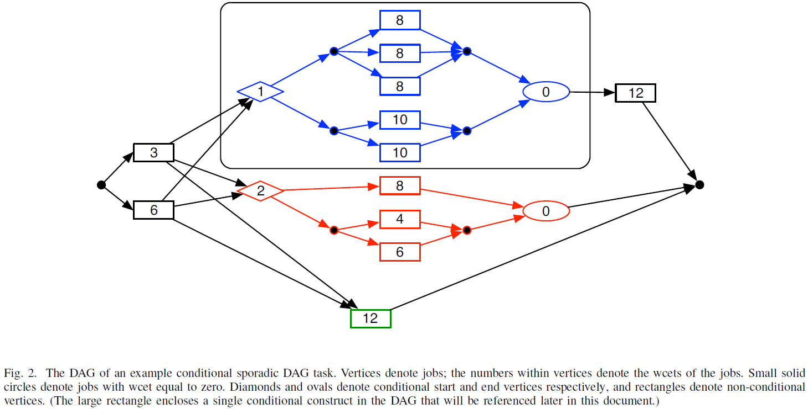

# The Global EDF Scheduling of Systems of Conditional Sporadic DAG Tasks

# サマリ

散発的DAGタスクモデル [3]の拡張として，条件付き散発的DAGタスクモデルを提案し，これらのタスクからなるシステムに対するGEDF (Global Earliest-Deadline First)スケジューリングに焦点を当てる．条件付き散発的DAGタスクモデルは，複雑な制御フローを含むタスクをモデル化でき，その表現能力が向上するが，スケジューラビリティテストは複雑になってしまう．そこで，条件付き散発的DAGタスクを多項式時間で(従来の)非条件付き散発的DAGタスクに変換する戦略を提案し，変換したタスクシステムに対して既存のテスト手法 [4]を適用した．結果として，条件付き散発的DAGタスクシステムでも従来の散発的DAGタスクシステムと同じ高速化率であることが示された．

## 分類

| Resource | Properties of tasks | Criterion |
| --- | --- | --- |
| $P$ | $dag_i, D_i\le T_i, prec, pmtn$ | - |

## 関連研究との比較

|  | DAGモデル | 条件分岐 | 疑似多項式時間でのGEDFスケジューラビリティテスト |
| --- | --- | --- | --- |
| [7, 12, 1, 10, 5] |  | - | - |
| [3, 11, 2, 13, 9] | x |  | - |
| [4, 8] | x |  | x |
| [6] | x | x |  |
| 本研究 | x | x | x |
- -： 言及なし
- 引用番号は論文内のもの

---

# 予備知識

- 非条件付き散発的DAGでは、*volume*(タスク全体の実行にかかる時間コスト)はDAG内のすべてのノードの最悪実行時間(wcet)の和
    - 条件付き散発的DAGではそれほど単純ではない

---

# システムモデル

## 前提

- 各タスクが条件付き散発的DAG
- ソース・シンクノードは1個ずつ
    - 複数ある場合にはダミーノードを追加することで容易に変換できるため、この仮定は一般性を損なわない
- 分岐係数(条件分岐するノードからのエッジの本数)は$2$とする
    - 分岐係数が$2$を超える条件も、DAGのサイズを多項式以上に大きくせずに分岐係数$2$の条件と等価なシーケンスに変換可能
- ある散発的DAGタスクによって生成されるジョブはすべて共通のリリース時刻とデッドラインを持つ

## タスクモデル

| Symbols | Descriptions |
| --- | --- |
| $\tau_i=(G_i,D_i,T_i)$ | 条件付き散発的DAGタスク |
| $G_i=(V_i, E_i)$ | DAG |
| $V_i$ | $G_i$のノード集合 |
| $|V_i|$ | $G_i$のノード数 |
| $E_i$ | $G_i$のエッジ集合 |
| $D_i$ | $\tau_i$の相対デッドライン |
| $T_i$ | $\tau_i$の最小リリース間隔 |
| $(c_{1},c_{2})$ | 条件分岐の (開始ノード, 終了ノード) |
| $k$ | 分岐係数; ある分岐開始ノードからの分岐数 |
| $s_{1},s_{2},\ldots,s_{k}$ | 分岐開始ノード$c_1$の後任ノード |
| $t_{1},t_{2},\ldots,t_{k}$ | 分岐終了ノード$c_2$の前任ノード |
| $V^{\prime}_{\ell}\subseteq V_{i}\ (\ell \in\{1,2,\ldots ,k\})$ | $s_\ell$から到達可能な$c_2$以外のノード集合 |
| $E^{\prime}_{\ell}\subseteq E_{i}\ (\ell \in\{1,2,\ldots ,k\})$ | $s_\ell$から到達可能な$c_2$以外のエッジ集合 |
| $m$ | プロセッサ数 |
| $n$ | タスク数 |
| $\tau=\{\tau_1, \tau_2,\ldots,\tau_n\}$ | タスクシステム |
| $\text{len}_{i}$ | $G_i$のクリティカルパス長 |
| $\mathcal{J}_{i}$ | $\tau_i$がとり得るdagジョブの全体集合 |
| $J\in\mathcal{J}_{i}$ | $G_i$を一度完全に実行して得られる(ノード)ジョブ列 |
| $\text{vol}_{i}$ | すべての$J$における、$J$内の全ジョブの合計wcetの最大値 |
| $\delta_{i}=\text{len}_{i}/D_{i}$ | $\tau_i$の密度 |
| $U_{i}=\text{vol}_{i}/T_{i}$ | $\tau_i$の利用率 |
| $\delta_{\max}(\tau)=\max_{\tau_{i}\in\tau}\{\delta_{i}\}$ | $\tau$の最大密度 |
| $U(\tau)=\sum_{\tau_{i}\in\tau}U_{i}$ | $\tau$の総利用率 |
| $s$ | プロセッサの速度 |

- $G_i$の条件分岐ノードの各対$(c_{1},c_{2})$に対して，$c_1$で始まり$c_2$で終わるの部分グラフを，$G_i$の**条件付き構成**と呼ぶ
- 条件付き構成の中には，さらに条件付き構成があっても良い
    - 中に条件付き構成を含まないような条件付き構成を，**最も内側の条件付き構成**という用語で説明する

- $\text{len}_{1}=(6+1+10+0+12)=29$
- $\text{vol}_{1}=6+3+25+12+12+12=70$
    - 上の条件付き構成で上の経路($1+(8\times 3)+0=25$)が選択され，下の条件付き構成で下の経路($2+(4+6)+0=12$)が実行される場合に合計wcetが最大

---

# アプローチ

## 非条件付き散発的DAGタスクシステムGEDFスケジューリング (先行研究)

いま，与えられた散発的DAGタスクシステム$\tau$の実行に利用可能な速度$s$のプロセッサが無限個あるとし，$\tau$によって生成されたジョブ集合を$J$とする．$S_{\infty}(J,s)$は，$J$の各ジョブが実行可能になった瞬間に速度$s$のプロセッサを割り当て，割り当てられたプロセッサでジョブの実行が完了するまで実行することで得られるスケジュールを表すとする．

**Definition 1 (*work*関数)：**  
$\tau_{i}$を散発的DAGタスク，$s$$\leq 1$を正の実数，$\tau_{i}$によって合法的に生成されるジョブの集合を$J$
とする．
任意の区間$I$に対して，$\text{work}(J,I,s)$は，スケジュール$S_{\infty}(J,s)$において，区間$I$内に実行され，デッドラインを持つジョブの実行量を表す．
任意の正の整数$t$に対して，$\text{work}(J,t,s)$は，長さ$t$の任意の区間$I$において，$\text{work}(J,I,s)$が取り得る最大値を表す．
最後に，$\text{work}(\tau_{i},t,s)$は，散発的DAGタスク$\tau_{i}$によって生成される全てのジョブ列$J$に対して，$\text{work}(J,t,s)$の最大値を表す．

つまり，$\text{work}(\tau_{i},t,s)$は，$\tau_{i}$によって生成されうるすべてのジョブ列$J$の中で，スケジュール$S_{\infty}(J,s)$において，長さ$t$の区間内に実行され，**この区間内にデッドラインを持つ**$J$のジョブの実行量の最大値として定義される。したがって，$\tau_{i}$の全てのデッドラインを常に満たすことができるスケジュールは、$\tau_{i}$のジョブを長さ$t$の区間で少なくとも$\text{work}(\tau_{i},t,s)$だけ実行できなければならない．

**Theorem 1 ([4])：**  
散発的DAGタスクシステム$\tau$は，任意の$t\geq 0$に対して次式を満たすような定数$\sigma, \delta_{\max}(\tau)\leq\sigma\leq 1$が存在するときに$m$個の単速度プロセッサでGEDFスケジュール可能．

$$
\sum_{\tau_{i}\in\tau}\text{work}(\tau_{i},t,\sigma)\leq(m-(m-1)\sigma)\times t \tag{1}
$$

したがって，与えられた$\tau$が$m$個の単速度プロセッサ上でEDFスケジューリング可能であることを示すには，上記のTheorem 1に従い，すべての$t\geq 0$に対して条件式(1)が成立するような$\sigma$の値を得れば十分．[4]のスケジューラビリティテストは，本質的に$\sigma\gets m/(2m-1)$がそのような値であるかを決定することに帰着する．この事実が散発的DAGタスクシステムのGEDFスケジューリングに$(2-1/m)$の高速化境界を与えることが[4]で示された．

**Corollary 1 ([4])：**  
GEDFは，散発的DAGタスクシステムを$m$個のプリエンプティブプロセッサでスケジュールする場合，高速化率が$\left(2-\frac{1}{m}\right)$となる．

**擬似多項式時間でのスケジューラビリティテスト：**  
[4]のスケジューラビリティテストは，本質的に$\sigma\gets m/(2m-1)$が全ての$t\geq 0$に対して条件式(1)を成立させるかを決定することからなり，複数の$t$に対して$\text{work}(\tau,t,m/(2m-1))$を計算する必要がある．[4]では，これを擬似多項式時間で効率的に実行できることが示され，結果として得られる擬似多項式時間GEDFスケジューラビリティテストは，任意の定数$\epsilon>0$に対して高速化率$(2-1/m+\epsilon)$となる．

## 条件付き散発的DAGタスクシステムのGEDFスケジューリング

*work*関数の定義を条件付き散発的DAGタスクに拡張し，Theorem 1とCorollary 1が条件付き散発的DAGタスクシステムに対して依然成立することを示す．

**条件付き散発的DAGタスクの*work*関数：**  
$J$について，ジョブの「合法的な」集合という概念が，従来の散発的DAGタスクではなく，条件付き散発的DAGタスクでの意味で満足されなければならないことを理解したうえで，Definition 1全体は変更を加えることなく条件付き散発的DAGタスクに拡張される．

**Theorem 1とCorollary 1の拡張：**  
[4]のTheorem 1とCorollary 1の証明では，与えられたタスクシステムによって合法的に生成されうるすべてのジョブの集合に対する最悪の場合の振る舞いを考慮することに基づいている．これらの証明で必要とされるジョブ集合の唯一の性質は，一対のジョブ間に優先度制約がある場合，これらのジョブ同じリリース時刻とデッドラインを持つことのみ．この性質は，条件付き散発的DAGタスクシステムによって生成されたジョブ集合である以上，自明に満たされる．したがって，証明は変更されず，Theorem 1とCorollary 1の条件付き散発的DAGタスクへの拡張として，以下のTheorem 2とCorollary 2が直ちに結論づけられる．

**Theorem 2：**  
条件付き散発的DAGタスクシステム$\tau$は，任意の$t\geq 0$に対して次式を満たすような定数$\sigma, \delta_{\max}(\tau)\leq\sigma\leq 1$が存在するときに$m$個の単速度プロセッサでGEDFスケジュール可能．

$$
\sum_{\tau_{i}\in\tau}\text{work}(\tau_{i},t,\sigma)\leq(m-(m-1)\sigma)\times t
$$

**Corollary 2：**  
GEDFは，条件付き散発的DAGタスクシステムを$m$個のプリエンプティブプロセッサでスケジュールする場合，高速化率が$\left(2-\frac{1}{m}\right)$となる．

## 条件付き散発的DAGタスクシステムのGEDFスケジューラビリティテスト

### *work*関数の導出

Corollary 2は，高速化率の観点から，条件付き構成の表現を可能にするために散発的DAGタスクモデルを拡張しても，追加のコストやペナルティが発生しないことを立証する．しかし，この結果自体は，条件付き散発的DAGタスクシステムのGEDFスケジューラビリティテスト手法を与えない．以下で，条件付き散発的DAGタスクシステムに対する効率的な(擬似多項式時間の)GEDFスケジューラビリティテストを導出する．

**Definition 2 (*rdem*関数 $\text{rdem}(\tau_{i},t,s)$)：**  
与えられた条件付き散発的DAGタスク$\tau_{i}$
の任意の$J\in\mathcal{J}_{i}$を考え，$t\leq D_{i}$を任意の正の実数とする．$\text{rdem}(J,t,s)$は，スケジュール$S_{\infty}(J,s)$において，$J$のジョブのリリース時刻から$t$時間単位後の残りの仕事量 ― すなわち，$J$に含まれる全ジョブの合計wcetから，既に実行されたものを引いたものを表す．$\text{rdem}(\tau_{i},t,s)$は，全ジョブ集合$J\in\mathcal{J}_{i}$における$\text{rdem}(J,t,s)$の最大値と定義される．

**Lemma 1：**  
$\tau_{i}$を制約付きデッドライン-条件付き散発的DAGタスクとする．すべての$s\geq\delta_{i}$および$t\leq D_{i}$に対して，次式が成り立つ．

$$
\text{work}(\tau_{i},t,s)=\text{rdem}(\tau_{i},D_{i}-t,s) \tag{2}
$$

$\text{work}(\tau_{i},t,s)$の値を定義するシナリオは，長さ$t$の区間の右端とデッドラインが一致する$\tau_{i}$のdagジョブがあり，$\tau_{i}$の他のdagジョブが可能な限り接近してリリースされるものである [4]．$\tau_{i}$の完全なdagジョブは，この区間内に$\lfloor t/T_{i}\rfloor$個存在し(Fig. 3)，これらのdagジョブの最大の仕事量は$\text{vol}_{i}$である．残りの区間(長さ$t\bmod T_{i}$)内にデッドラインを持つジョブの実行量を決定する必要がある．$(t\bmod T_{i})\geq D_{i}$であれば，dagジョブ全体がこの区間に収まるため，その仕事量は$\text{vol}_{i}$であり，次の関係が成り立つ．

$$
\text{work}(\tau_{i},t,s)=\text{vol}_{i}\times\lfloor t/T _{i}\rfloor\ +\left\{\begin{array}{ll}\text{vol}_{i},&\text{if }(t\bmod T_{i})\geq D_{i}\\ \text{work}(\tau_{i},t\bmod T_{i},s),&\text{if }(t\bmod T_{i})\leq D_{i} \end{array}\right.
$$

$(t\bmod T_{i})\leq D_{i}$の場合にLemma 1を適用して，次式を得る．

$$
\text{work}(\tau_{i},t,s)=\text{vol}_{i}\times\lfloor t/T _{i}\rfloor\ +\left\{\begin{array}{ll}\text{vol}_{i},&\text{if }(t\bmod T_{i})\geq D_{i}\\ \text{rdem}(\tau_{i},D_{i}-(t\bmod T_{i}),s),&\text{if }(t\bmod T_{i})\leq D_{i} \end{array}\right. \tag{3}
$$

$D_{i}=15, T_{i}=20, t\gets 70$のタスクの例

これにより，すべての$t$について$\text{work}(\tau_{i},t,s)$を計算する問題を，$t\leq D_{i}$の値について$\text{rdem}(\tau_{i},t,s)$を計算する問題に縮小した．残る問題は，$t\leq D_{i}$の値に対して$\text{rdem}(\tau_{i},t,s)$をどのように計算するかのみ．

まず，単位速度プロセッサのプラットフォームで実行されるタスク$\tau_{i}$の$\text{rdem}(\tau_{i},t,1)$を計算する例を挙げる．このタスクは，$D_{i}=15$および$T_{i}=20$であり，Fig. 4に示すようなDAG $G_{i}$を持つ．$G_{i}$では，$\tau_{i}$
のdagジョブがリリースされるたびに，$\text{wcet}=1$を持つ条件式が評価される．この評価の結果に応じて，それぞれ並列実行可能な$\text{wcet=8}$の3つのジョブか，$\text{wcet=10}$の2個のジョブが実行される．分岐の再合流にかかる実行コストはないため，条件分岐の終了ノードは$\text{wcet=0}$．

Fig. 2の四角形で囲まれた部分の条件付き構成となっている

この例のタスク$\tau_{i}$について，$t$の関数として$\text{rdem}(\tau_{i},t,1)$を決定する．このタスクでは$|\mathcal{J}_{i}|=2$である．すなわち，このタスクの1個のdagジョブに対して，このDAGを通る制御フローは2通り考えられる(上の経路 or 下の経路)。ここでは，上の経路と下の経路を別々に考え，その結果の関数をFig. 5にグラフで示す．

- **上の経路を通る場合 (青線)．** 残余仕事量は、点$(0, 25)$を始点とし，最初の時点で25単位の仕事が残っている．区間$[0,1)$で実行される仕事は条件式のノードに対応する1単位のみであるため，この区間の直線の傾きは$-1$．条件式が評価されると，3個のジョブが8時間単位で並行して実行されるため，傾きは$-3$となる．
- **下の経路を通る場合 (赤線)．** 残余仕事量は，点$(0, 21)$を始点とし，最初の時点で21単位の仕事が残っている．上の場合と同様に，条件付きノードに対応する仕事だけが区間$[0,1)$で実行され，この区間の線の傾きは$-1$．条件式が評価されると，2個のジョブが10時間単位で並行して実行されるため，傾きは$-2$となる．

図から明らかなように，$t\leq 5$の場合には上の経路を実行すると$t$時間単位後に多くの仕事が残り(青線)，$t\geq 5$の場合には下の経路を実行するとより多くの仕事が残る(赤線)．つまり，二つの異なる経路に対応する個々の*rdem*関数の上側包絡線は，すべての$t$の値に対する残余仕事量の最大値を表す．したがって，$\text{rdem}(\tau_{i},t,1)$は，Fig. 5にプロットされた二つの個別の*rdem*線の上側包絡線となる．

次に式(3)を適用して，Fig. 4のタスクの例について，$t=65,70,72,78$の場合の$\text{work}(\tau_{i},t,1)$を計算する例を挙げる．すべての$t$について，$\lfloor t/T_{i}\rfloor=3$かつ$\text{vol}_{i}\times\lfloor t/T_{i}\rfloor=25\times 3=75$となっている．$(t\bmod T_{i})$は，$t=65,70,72$では$\leq D_{i}$だが，$t=78$では$>D_{i}$となる．各$t$の値に対して式(3)を別々に適用することにより、以下を得る．

$$
\begin{align*}
\text{work}(\tau_{i},65,1) &= 75+\text{rdem}(\tau_{i},10,1)=75+2=77\\
\text{work}(\tau_{i},70,1) &= 75+\text{rdem}(\tau_{i},5,1)=75+12=87\\
\text{work}(\tau_{i},72,1) &= 75+\text{rdem}(\tau_{i},3,1)=75+18=93\\
\text{and}\quad\text{work}(\tau_{i},78,1) &= 75+\text{vol}_{i}=75+25=100
\end{align*}
$$

Fig. 5で例として示した*rdem*関数を計算するアプローチは，制約付きデッドライン-条件付き散発的DAGタスク$\tau_{i}$の*rdem*関数を計算するための簡単な方法論として容易に一般化可能：

- 各$J\in\mathcal{J}_{i}$について$\text{rdem}(J,t,s)$を計算する
- 得られた個々の$\text{rdem}(J,t,s)$の上側包絡線が$\text{rdem}(\tau_{i},t,s)$となる

### 条件付き散発的DAGタスクから非条件付き散発的DAGタスクへの変換

ここまでのアプローチは正しいが，[6]と同様の問題を抱える：
$|\mathcal{J}_{i}|$はDAGのサイズに対して指数関数的になりうるため，アルゴリズム全体は指数関数的な時間を要する．そこで，この方法で*rdem*関数を明示的に計算する代わりに，*rdem*関数の特性に関して上記で得た洞察を利用して、条件付き散発的DAGタスクシステムのGEDFスケジューラビリティ分析のより効率的なアプローチを開発する．与えられたタスクシステムがTheorem 2を満たすかどうかを直接判断するのではなく(そのためには*work*関数を明示的に計算する必要がある)，代わりに各条件付き散発的DAGタスク$\tau_{i}$を非条件付きタスク$\tau_{i}^{\prime}$に効率的に**変換**する．

変換前後の二つのタスクは，同一の*len*，*vol*，デッドライン，周期を持つという意味で「等価」であり，すべての$t\geq 0$および$s\geq\delta_{i}$に対して，次が成り立つ．

$$
\text{work}(\tau_{i},t,s)=\text{work}(\tau_{i}^{\prime},t,s) \tag{4}
$$

したがって，条件付き散発的DAGタスクシステム$\tau$は、$\tau$の各タスク変換して得られる非条件付き散発的DAGタスクシステム$\tau^{\prime}$
がTheorem 1を満たす場合にのみ，Theorem 2を満たす．そして、[4]の非条件付き散発的DAGタスクシステムに対する擬似多項式時間GEDFスケジューラビリティテストを非条件付き散発的DAGタスクシステム$\tau^{\prime}$に適用することで，任意の定数$\epsilon>0$に対して高速化率$(2-1/m+\epsilon)$の条件付き散発的DAGタスクシステムに対する擬似多項式時間GEDFスケジューラビリティテストを得られる．

Fig. 4の例のタスクを変換する例を挙げる．$D_{j}=D_{i}=15,
T_{j}=T_{i}=20$であり，Fig. 6に示すDAG $G_{j}$を持つタスク$\tau_{j}$を考える．このタスクの*rdem*関数は、Fig. 5に描かれた二つの*rdem*関数の上側包絡線と同一であることが容易に検証可能．したがって，**タスク$\tau_{i}$と$\tau_{j}$は同一の*rdem*関数**(すなわち同一の*work*関数)を持ち，$\tau_{j}$は，同一の*work*関数を持つという意味で$\tau_{i}$と「等価」な非条件付き散発的DAGタスクである．

**$\tau_{j}$を得る方法：**  
基本的にFig. 5を検証し，二つの*rdem*関数の上側包絡線に等しい*rdem*関数を持つ非条件付き散発的DAGタスクの構築を目指した．

- 上側包絡線は区間$[0,1)$で$-1$の傾きを持つため，$\text{wect}=(1-0)=1$のノードを1個導入した．
- 上側包絡線の傾きは区間$[1,5)$で$-3$である．これは，$\text{wect}=(5-1)=4$の3個のノードからなる2番目の「層」を後任ノードとして追加することでモデル化される．
- 上側包絡線の傾きは区間$[5,11)$で$-2$である．これは，$\text{wect}=(11-5)=6$の2個のノードからなる3番目の層を後任ノードとして追加することでモデル化される．
- $\text{wect}=0$の1個のノードを持つ最後の層は，条件付き構成の終わりを表す．
- (各層の各ノードから直後の層のすべてのノードへのエッジを追加)

ただし，個々の*rdem*関数の上側包絡線を得るためには，まず，すべての(おそらく指数関数的に多数の)ありうる制御フローについて，これらの個々の*rdem*関数を明示的に計算しなければならないため，これだけではこの手法が以前の手法より効率的には見えない．条件付き散発的DAGタスクを等価な非条件付きタスクに効率的に変換するためには，もう一つの成果が必要となる．以下に例を挙げてその成果を説明する．

### 効率的な変換アルゴリズム

Fig. 4のDAGは，Fig. 2のDAGの中の一つの条件付き構成として現れる．もし，Fig. 2のDAGの条件付き構成全体をFig. 6のDAGに置き換えると，**条件付き構成が1つ少ない**条件付きDAGが得られ，(以下のTheorem 3により)*work*関数はFig. 2のDAGの*work*関数と同じになる．Fig. 2のDAGのもう一つの(下の)条件付き構成についても同様に考えられる．Fig. 7は，この下の条件付き構成に同様の変換を適用したものである．Fig. 8は，両方の変換を適用した結果の非条件付きDAGを示している．

Fig. 2の条件付きDAGに対して，上の条件付き構成をFig. 4のDAGで，下の条件付き構成をFig. 7のDAGで置き換えて得られた非条件付きDAG

**変換アルゴリズム：**  
条件付き散発的DAGタスク$\tau_{i}$を等価な非条件付き散発的DAGタスク$\tau_{i}^{\prime}$に変換する．$D_{i}^{\prime}\gets D_{i}$および$T_{i}^{\prime}\gets T_{i}$である．$G_{i}$から開始し，DAG内に条件付き構成がなくなるまで以下を繰り返して$G_{i}^{\prime}$を得る．

1. 最も内側の条件付き構成を特定する
2. 特定した条件付き構成と等価な非条件付きDAGを構築する(方法は後述)
3. 特定した条件付き構成を、等価な非条件付きDAGに置き換える

**等価な非条件付きDAGの構成：**  
Fig. 1に表されている最も内側の条件付き構成に相当する非条件付きDAGを求めることを考える．

- $\{c_{1},c_{2}\}\cup V_{1}^{\prime}$と$\{c_{1},c_{2}\}\cup V_{2}^{\prime}$のすべてのノードにそれぞれ対応するジョブ集合の*rdem*関数を別々に構築する．各*rdem*は区分線形であり，区分数はグラフのノード数によって上界され，各線分は負の整数の傾きを持つ．
- これらの二つの*rdem*関数の上側包絡線を決定する．この上側包絡線も区分線形となり，各線分は負の整数の傾きを持ち、区分の総数は$\{c_{1},c_{2}\}\cup V_{1}^{\prime}\cup V_{2}^{\prime}$ のノード数で上界される．
- 上で決定した上側包絡線と同じ*rdem*関数を持つDAG $G^{\prime\prime}=(V^{\prime\prime},E^{\prime\prime})$を構築する．このグラフは，$(上側包絡線の区分数)+1$層からなる「層状」グラフとして構成される．第$k$層のノード数は上側包絡線の第$k$区分の(負の)傾きに等しく，各ノードは第$k$区分の時間軸の長さに等しいwcetを持つ．最後の層は$\text{wcet}=0$の1個のシンクノードからなる．各ノードから直後の層の各ノードへのエッジが存在する．

このDAG $G^{\prime\prime}=(V^{\prime\prime},E^{\prime\prime})$は等価な非条件付きDAGである．

**Theorem 3：**  
$\tau_{i}$は制約付きデッドライン-条件付き散発的DAGタスクを表し，$\hat{\tau}_{i}$は$\tau_{i}$のDAG $G_{i}$の最も内側の条件付き構成を等価な非条件付きDAGで置き換えることによって得られる(条件付き or 非条件付きの)散発的DAGタスクを表すとする．
すべての$t,0\leq t\leq D_{i}$について，$\text{{\sf redem}}(\tau_{i},t,s)=\text{{\sf redem}}(\hat{\tau}_{i},t,s)$
(したがって，すべての$t$について$\text{{\sf work}}(\tau_{i},t,s)=\text{{\sf work}}(\hat{\tau}_{i},t,s)$)．

### 条件付き散発的DAGタスクの$\text{{\sf vol}}_{i}$の算出

条件付き散発的DAGタスクを上記の変換によって等価な非条件付き散発的DAGタスクに変換し，変換後のDAGの全ノードのwcetの単純和として$\text{vol}_{i}$が得られる．$\text{vol}_{i}$が得られれば，残りのパラメータ(各タスクの$\text{len}_{i}, \delta_{i}, U_{i}$およびタスクシステムの$\delta_{\max}(\tau), U(\tau)$)は非常に効率的に導出できる．