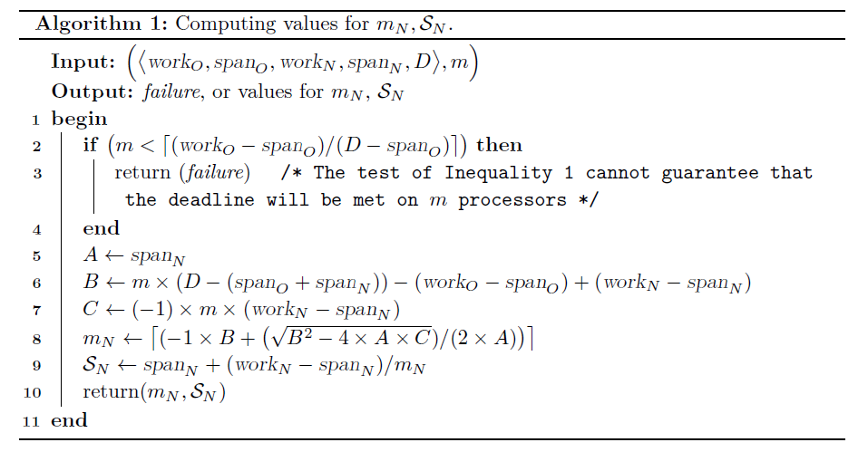
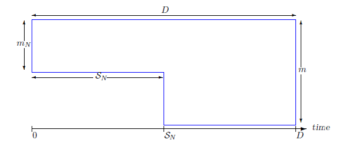
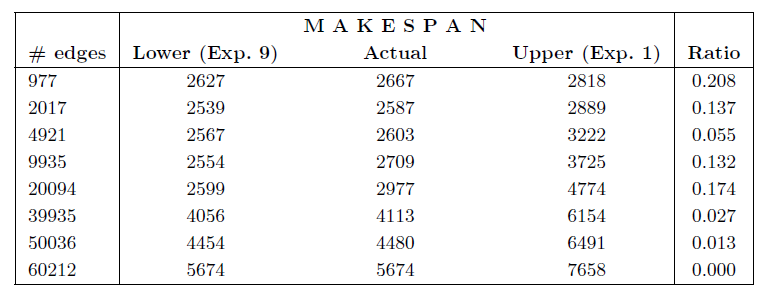

# 論文まとめテンプレート

## サマリ
- [元論文pdfのリンク](https://drops.dagstuhl.de/opus/volltexte/2018/8999/pdf/LIPIcs-ECRTS-2018-5.pdf)
- 2018
- ECRTS
- A Measurement-Based Model for Parallel Real-Time Tasks
- 本論文では、並列リアルタイムコードを表現するための「work」と「span」の2つのパラメータを用いた新しいモデルを提案
- 提案スケジューリングアルゴリズムは、リソースの効率的な利用を目指し、多くのプロセッサをスリープモードに保ちながらデッドラインを確実に満たす能力を持つ

### 分類
<!-- [スケジューリング手法の分類法](https://tier4.atlassian.net/wiki/spaces/~6422e65c57f0c028e2f72804/pages/2780268789)に従って以下の表を埋める-->

| Resource     | Properties of tasks | Criterion    |
| :----------: | :-----------------: | :----------: |
| $P$ | $D_i, prll_{malleable}$ | $R, energy$ |

### 関連研究との比較
<!-- 関連研究の章を基に以下のような比較表を作成する -->

|          | Makespan | Multiple parameters for Task | pWCET | Accuracy and efficiency |
| :------: | :---: | :---: | :-: | :---: |
| [15,16,17] |   x   |       |     |      |
| [14,23]    |       |    x   |     |       |
| [20,21,22] |     |       |x | |
| [23,25]| | | | x|
|  本論文  |   x   |   x   |  x  |   x   |

※ -: 言及なし
※ -: 引用番号は論文内のもの

## 予備知識
- makespan: 特定のタスクまたはプロジェクトの完了にかかる時間を示す尺度

## システムモデル

### 前提
- 同一のプロセッサ
- 単一のタスク
- リストスケジューリング
- マルチプロセッサにおける周期的/散発的なDAGSetに対するfederatedにも適用可能

### タスクモデル
- モデル定義
$<work_O, span_O, work_N, span_N, D>$
- 仮定
$\operatorname{work}_N\leq\operatorname{work}_{O}$ および $\operatorname{span}_N\leq\operatorname{span}_{O}$

|   Symbols    | Descriptions |
| :----------: | :----------: |
|  **work** | すべての並列分岐のワーストケースの累積実行時間 (プロセッサの同期による通信オーバーヘッドを無視) |
| **span** | 優先順位に制約のあるコード・シーケンスの最大累積ワーストケース実行時間 |
| $work_O$ | 真の「最悪の場合」の値の非常に保守的な見積もりの作業パラメータ |
| $span_O$ | 真の「最悪の場合」の値の非常に保守的な見積もりのスパンパラメータ |
| $work_N$ | より保守的でない見積もりの作業パラメータ |
| $span_N$ | より保守的でない見積もりのスパンパラメータ |
|$D$|相対デッドライン|
| $m$ | コア数 |
|$m_N$| 起動必須コア数|
|$S_N$| スリープコアをアクティブにする時間|

### 定義
- リストスケジューリングによって生成されるスケジュールのmakespanの上界
　$\frac{work-span}{m}+span$ 
- 相対デッドラインとmakespanの関係
　$\frac{work-span}{m}+span \leq D$

## アプローチ
### work と span の推定.
1. Rapita Systemsの[RapiTime](https://www.rapitasystems.com/products/rapitime)のようなpWCETツールでWCET分布を推定
2. WCET分布を用いて単一プロセッサ上のWCETの分布を推定 => **work**
3. WCET分布を用いて複数プロセッサ上のWCETの分布を推定 => **span**
    - spanの値は、無限数のプロセッサを使用した場合のWCETの分布
    - spanの確率分布を求めるためには、異なる数のプロセッサを使用してコードを繰り返し実行する必要がある．
4. 任意の確率$p$の時の**work**や**span**の最大値を$work_N, span_N$とする
5. $p^{\prime}\ll p$の時の**work**や**span**の最大値を$work_O, span_O$とする

### スケジューリングアルゴリズム
1. $m_N$ および $S_N$ を計算

    - Line 2-4 $\frac{work-span}{m}+span \leq D$より，この条件を満たさないときはスケジュール不可
    - Line 8 $m_N$を計算
    - Line 9 $m_N$を用いて$S_N$を計算
- 時間複雑度：$\Theta(1)$
-  $m_N$ および $S_N$ の値は正確性にはかかわらず，効率にかかわるパラメータ

2. スケジュール

    - 並列化可能なリアルタイムコードが、実行時のある時間インスタント $t_o$ にアクティブ化されたと仮定
    1. タスクを $m_N$ 個のプロセッサ上でリストスケジューリングアルゴリズム [17] を使用して実行を時間インスタント $(t_o)$ で開始
    このタスクに割り当てられた残りの $(m-m_N)$ 個のプロセッサはスリープモードに変更
    2. タスクが時間インスタント $(t_o+S_N)$ までに実行が完了しない場合
        スケジューラは $(m-m_N)$ 個のスリーププロセッサを起動し、タスクの残りの部分を全ての $m$ 個のプロセッサのバンクでリストスケジューリングを使用して実行
    3. 周期的なタスクの場合、起動されたプロセッサは現在のdag-jobの実行が完了すると、スリープモードに戻る

### より厳密な$m_N$ および $S_N$の計算
- 実際のリストスケジューリング生成スケジュールのmakespanは、上限：$\frac{work-span}{m}+span$ と下限：$\max(\frac{work}{m},span)$の下限に近付く傾向がある
- $S_N$の計算方法
  - $S_N\leftarrow\max(\frac{work_N}{m_N},span_N)+\alpha\cdot[(\frac{work_N-span_N}{m}+span_N)-\max(\frac{work_N}{m_N},span_N)]$
  - $\alpha$:チューニングパラメータ
    - $\alpha$の値が小さいほど、オフにできるプロセッサの数は増えるが，タスクの実行中にそれらを起動する必要がある可能性も高くなる
- $m_N$の計算方法
  - 上記で計算した$S_N$の値を用いたときに，makespanの上限値 $\leq$ デッドライン (以下の式) を満たす初めての$m_N$を取得
  
  $$
  \begin{align*}
  &\left(\mathcal{S}_{N}+\left(\frac{\text{work}_{O}-\mathcal{S}_{N }\times m_{N}-\text{span}_{O}}{m}+\text{span}_{O}\right)\right) \leq D \\
  &\Leftrightarrow \left(\mathcal{S}_{N}-\frac{\mathcal{S}_{N}\times m_{N}}{m}\right) \leq \left(D-\frac{\text{work}_{O}-\text{span}_{O}}{m}-\text{span}_{O}\right) \\
  &\Leftrightarrow \mathcal{S}_{N}\left(1-\frac{m_{N}}{m}\right) \leq \left(D-\frac{\text{work}_{O}-\text{span}_{O}}{m}-\text{span}_{O}\right)
  \end{align*}
  $$

- 時間複雑度：$\Theta(m)$

## 評価
- 評価手法 
  - ランダムに生成されたモデルを用い，makespanの下限と上限を計算
  - リストスケジューリングで実行し，実際のmakespanとの誤差を評価
  - スケジューリングの評価ではなく，makespanが本当に下限に近付くかを評価

- タスク生成手法 (ベース Erdos-Renyi法)
  - DAGの頂点数$n$、最大WCETパラメータ$w$、目標の辺の数$e$、およびプロセッサ数$m$を指定
  - 各頂点に、範囲$(1,w)$の間でランダムかつ一様にWCETを割り当て
  - i := 1からnまで、j := (i+1)からnまで、確率$p$で辺(i,j)を作成
    - $p \leftarrow \frac{2e}{n \times (n-1)}$
    - インデックスの低い頂点から高い頂点への向きを持つ

- 実行手法
  - 各頂点が正確にそのWCE値で実行されると仮定
  - リストスケジューリングで実行

- 結果

- Lowerの計算式 $\max(\frac{work}{m},span)$
- Upperの計算式 $\frac{work-span}{m}+span$
- Ratioの計算式 $(\text{Actual} - \text{Lower}) ÷ (\text{Upper} - \text{Lower})$
  - 小さい値は、実際のmakespanが下限に近いことを示す

- 考察
  - None